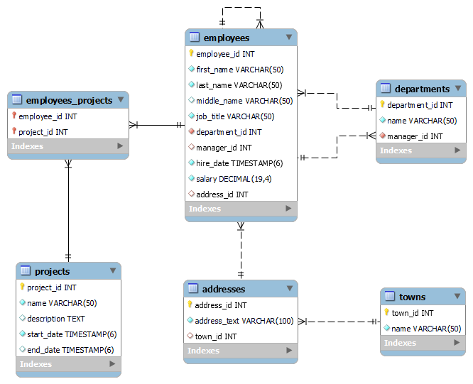

# Introduction to Hibernate

**Exercises**

**Goals to achieve:** Working with database using an ORM framework Hibernate.

**_01 Setup_**

- Create and fill needed database *soft_uni* by executing provided *[sql](Database_For_Exercise/soft_uni_database.sql)* script.
- Set *[persistence.xml](src/main/resources/META-INF/persistence.xml)* configuration file.
- Create EntityManagerFactory and run program.

My solution -> *[E01Setup](src/main/java/E01Setup.java)*

**_02 Change casing_**

- Persist all towns from the database. Detach those whose name length is more than 5 symbols. Then transform the names of all attached towns to uppercase and save them to the database.

My solution -> *[E02ChangeCasing](src/main/java/E02ChangeCasing.java)*

**_03 Contains Employee_**

- Write a program that checks if a given employee name is contained in the database.

My solution -> *[E03ContainsEmployee](src/main/java/E03ContainsEmployee.java)*

**_04 Employees with Salary Over 50 000_**

- Write a program that gets the first name of all employees who have salary over 50 000.

My solution -> *[E04EmployeesWithSalaryOver50000](src/main/java/E04EmployeesWithSalaryOver50000.java)*

**_05 Employees from Department_**

- Extract all employees from the Research and Development department. Order them by salary (in ascending order), then by id (in ascending order). Print only their first name, last name, department name and salary.

My solution -> *[E05EmployeesFromDepartment](src/main/java/E05EmployeesFromDepartment.java)*

**_06 Adding a New Address and Updating Employee_**

- Create a new address with text "Vitoshka 15". Set that address to an employee with a last name, given as an input.

My solution -> *[E06AddingANewAddressAndUpdatingEmployee](src/main/java/E06AddingANewAddressAndUpdatingEmployee.java)*

**_07 Addresses with Employee Count_**

- Find all addresses, ordered by the number of employees who live there (descending).
- Take only the first 10 addresses and print their address text, town name and employee count.

My solution -> *[E07AddressesWithEmployeeCount](src/main/java/E07AddressesWithEmployeeCount.java)*

**_08 Get Employee with Project_**

- Get an employee by his/her id. Print only his/her first name, last name, job title and projects (only their names). The projects should be ordered by name (ascending).

My solution -> *[E08GetEmployeeWithProject](src/main/java/E08GetEmployeeWithProject.java)*

**_09 Find Latest 10 Projects_**

- Write a program that prints the last 10 started projects. Print their name, description, start and end date and sort them by name lexicographically.

My solution -> *[E09FindLatest10Projects](src/main/java/E09FindLatest10Projects.java)*

**_10 Increase Salaries_**

- Write a program that increases the salaries of all employees, who are in the Engineering, Tool Design, Marketing or Information Services departments by 12%. Then print the first name, the last name and the salary for the employees, whose salary was increased.

My solution -> *[E10IncreaseSalaries](src/main/java/E10IncreaseSalaries.java)*

**_11 Find Employees by First Name_**

- Write a program that finds all employees, whose first name starts with a pattern given as an input from the console. Print their first and last names, their job title and salary in the format given in the example below.

My solution -> *[E11FindEmployeesByFirstName](src/main/java/E11FindEmployeesByFirstName.java)*

**_12 Employees Maximum Salaries_**

- Write a program that finds the max salary for each department. Filter the departments, which max salaries are not in the range between 30000 and 70000.

My solution -> *[E12EmployeesMaximumSalaries](src/main/java/E12EmployeesMaximumSalaries.java)*

**_13 Remove Towns_**

- Write a program that deletes a town, which name is given as an input. The program should delete all addresses that are in the given town. Print on the console the number of addresses that were deleted.

My solution -> *[E13RemoveTowns](src/main/java/E13RemoveTowns.java)*

&nbsp;

### *soft_uni database EER diagram*

&nbsp;

