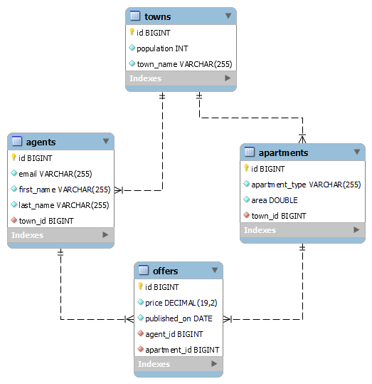

# Real Estate Agency Application

**_Real Estate Agency_** shoud represents web-based application that collects all the information about available estates and can dig through the sorted best offers.

**Goals to achieve:**

**_1.Model Definition_**

There are 4 main models that the Real Estate Agency database application should contain in its functionality.

- Town
- Agent
- Apartment
- Offer

**_2.Data Import_**

The application should be able to import hard-formatted data in JSON and XML format.

**_3.Data Export_**

The application shoud be able to export data according to a predetermined criterions and format.
