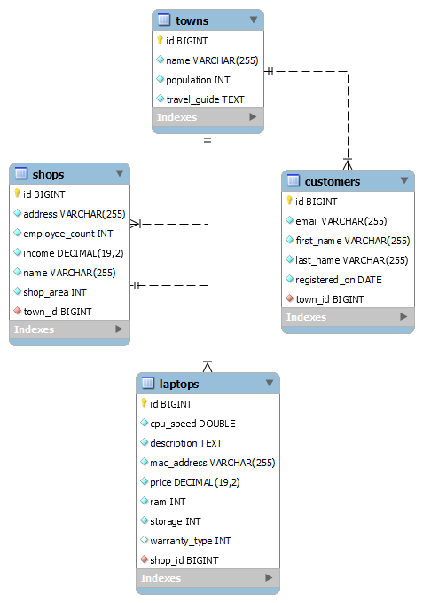

# Laptop Shop Application

**_Laptop Shop_** shoud accept data from familiar formats (json & xml) and return the data that is listed. It needs to hold selection of the best office, professional or gaming mobile computers. The application should be able to collect all the information about all available laptops and with one click, dig through the sorted best offers.

**Goals to achieve:**

**_1.Model Definition_**

There are 4 main models that the Laptop Shop database application should contain in its functionality.

- Town
- Shop
- Customer
- Laptop

**_2.Data Import_**

The application should be able to import hard-formatted data in JSON and XML format.

**_3.Data Export_**

The application shoud be able to export best laptops from the data base. Exported data must contain:

- mac address
- CPU speed
- ram
- storage
- price
- name of the shop
- name of the town

Exported data shoud be ordered first by cpu speed in descending order, then by the ram in descending order, then by the storage in descending order and finally by the MAC Address.