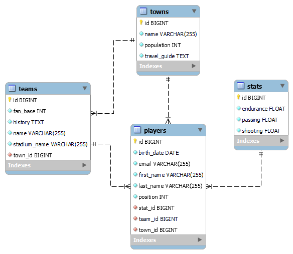

# Player Finder Application

**_Player Finder_** shoud accept data from familiar formats (json & xml) and return the data that is listed. It needs to hold the information about football players.

**Goals to achieve:**

**_1.Model Definition_**

There are 4 main models that the Player Finder database application should contain in its functionality.

- Town
- Team
- Stat
- Player

**_2.Data Import_**

The application should be able to import hard-formatted data in JSON and XML format.

**_3.Data Export_**

The application shoud be able to export best players data from the database according to a predetermined criterions and format:

- first name
- last name
- position
- team name
- name of the stadium of the team

Birth date of the selected players should be after 01-01-1995 and before 01-01-2003.

Exported data must be ordered first by shooting in desc order, then by passing in desc order, then by endurance in desc order and finally by player last name.