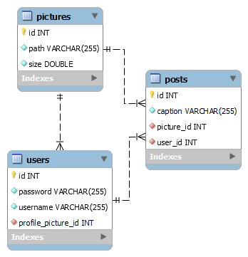

# Instagraph – Lite Application

**_Instagraph – Lite_** shoud accept data from familiar formats (json & xml) and return the data that is listed. It needs to hold the information about users and their posts.

**Goals to achieve:**

**_1.Model Definition_**

There are 3 main models that the Instagraph – Lite database application should contain in its functionality.

- Picture
- User
- Post

**_2.Data Import_**

The application should be able to import hard-formatted data in JSON and XML format.

**_3.Data Export_**

The application shoud be able to export user's data and posts from the database according to a predetermined criterions and format:

- username
- count of posts
- post caption
- picture size

Birth date of the selected players should be after 01-01-1995 and before 01-01-2003.

Exported data must contain the posts of each user, ordered by the post's picture size in ascending order.