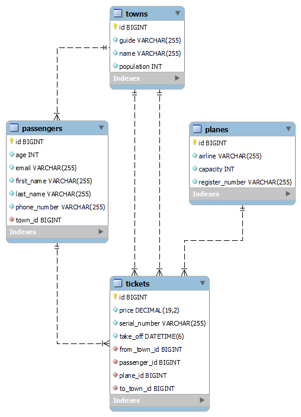

# Airline Company Application

**_Airline Company_** shoud accept data from familiar formats (json & xml) and return the data that is listed. It needs to hold the information of all the tickets, that are being bought, all the passengers, their destination, etc.

**Goals to achieve:**

**_1.Model Definition_**

There are 4 main models that the Airline database application should contain in its functionality.

- Town
- Passenger
- Plane
- Ticket

**_2.Data Import_**

The application should be able to import hard-formatted data in JSON and XML format.

**_3.Data Export_**

The application shoud be able to export data from the database according to a predetermined criterions and format:

- first name
- last name
- email
- phone
- count of tickets.

Exported data must be ordered first by tickets count in descending order then by email alphabetically.