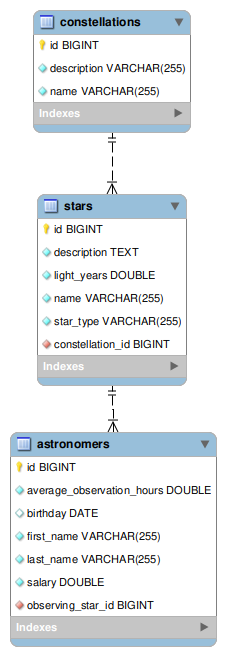

# Find A Star Application

**_Find A Star_** shoud accept data from familiar formats (json & xml) and return the data that is listed. It needs to hold the information of constellations, stars in each constellation and astronomers who observe stars.

**Goals to achieve:**

**_1.Model Definition_**

There are 3 main models that the Find A Star database application should contain in its functionality.

- Constellation
- Star
- Astronomer

**_2.Data Import_**

The application should be able to import hard-formatted data in JSON and XML format.

**_3.Data Export_**

The application shoud be able to export data from the database according to a predetermined criterions and format:

- star name
- distance in light years
- star description
- constellation name

Exported data must contain only stars who are Red Giants and have never been observed, ordered by the light years in ascending order.