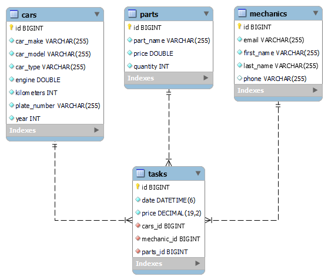

# Car Repair Service Application

**_Car Repair Service_** shoud accept data from familiar formats (json & xml) and return the data that is listed. It needs to hold information about cars, spare parts, mechanics and service tasks.

**Goals to achieve:**

**_1.Model Definition_**

There are 4 main models that the Car Repair Service database application should contain in its functionality.

- Part
- Mechanic
- Car
- Task

**_2.Data Import_**

The application should be able to import hard-formatted data in JSON and XML format.

**_3.Data Export_**

The application shoud be able to export data for the highest priced tasks from the database according to a predetermined criterions and format:

- car's make
- car's model
- car's engine
- mechanic's first name
- mechanic's last name
- task id
- task price

Exported data must be filtered only for coupe cars and ordered by the price in descending order.