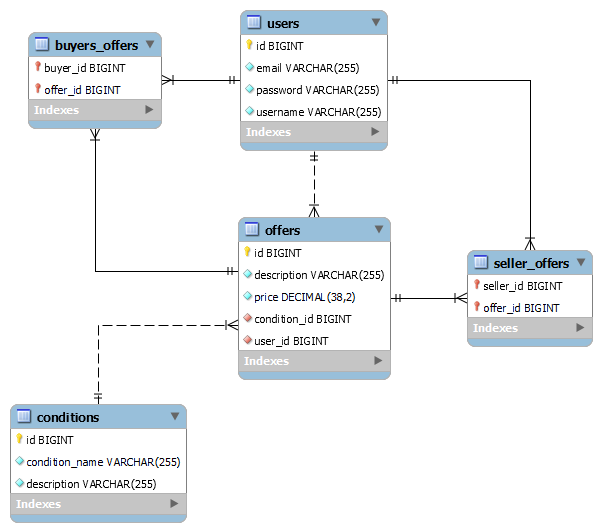
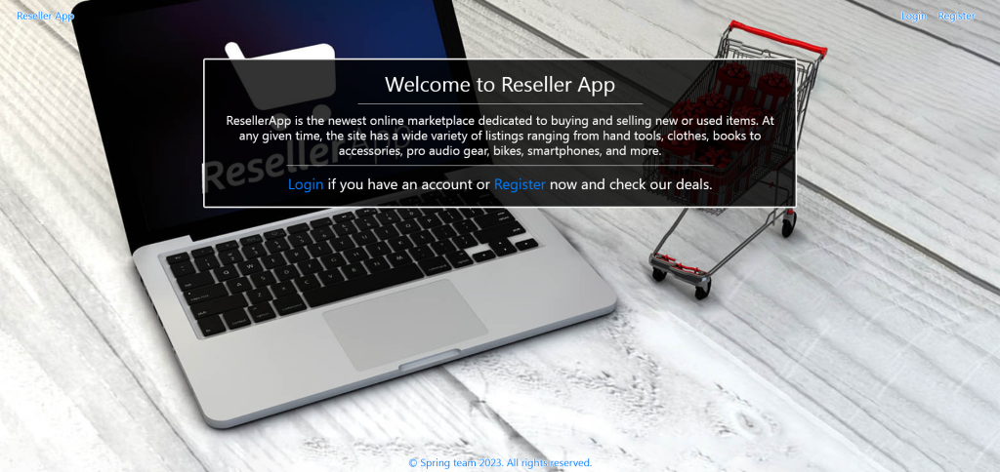
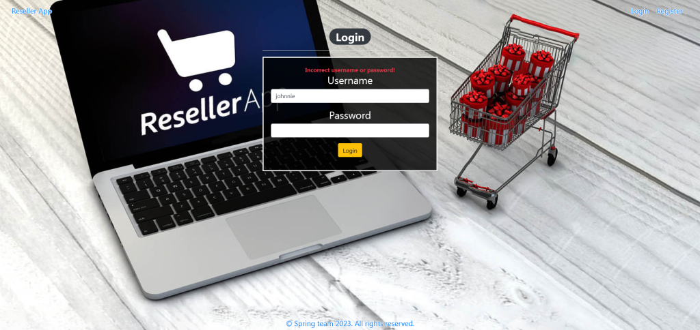
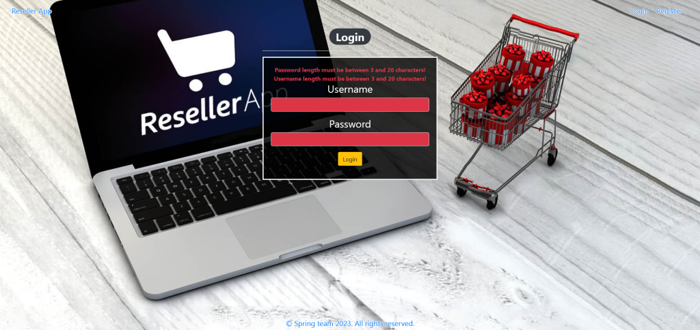
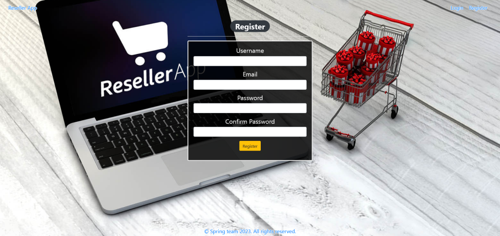
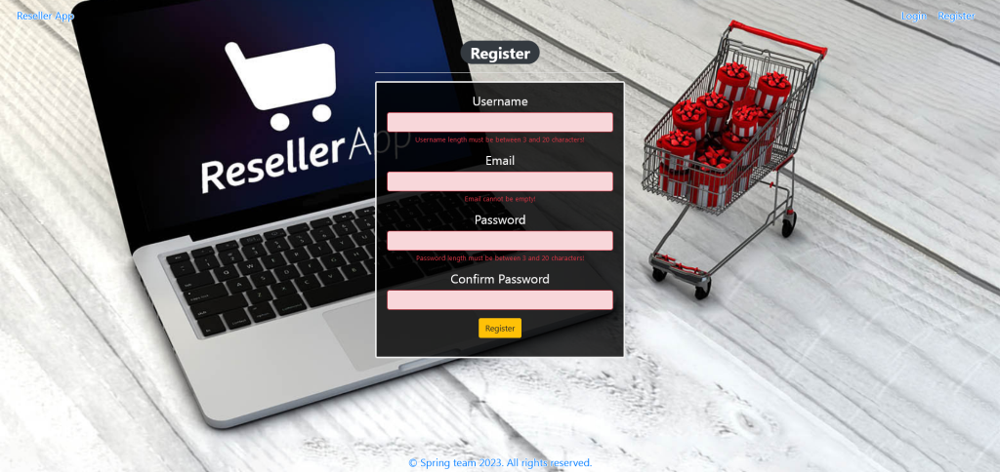
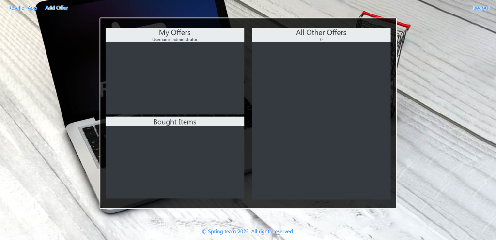
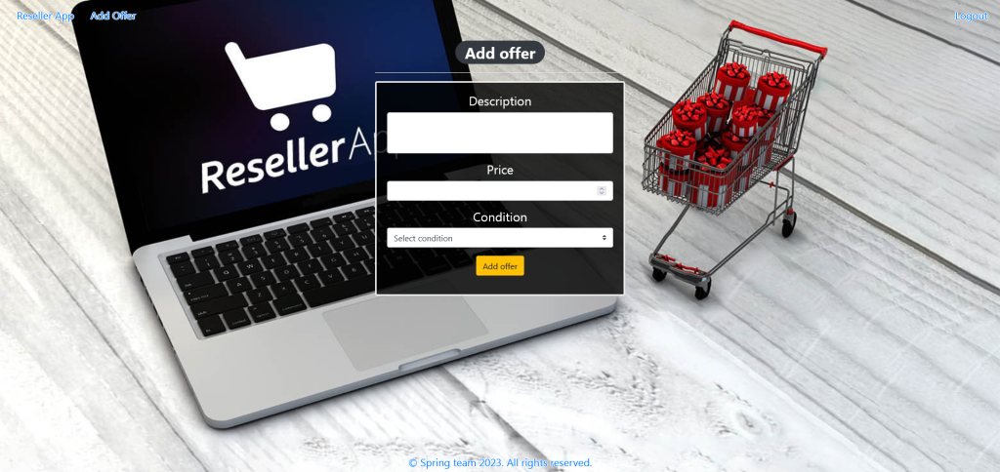
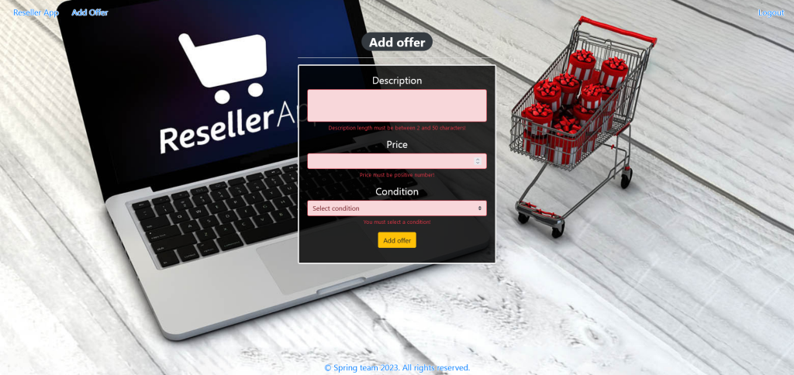
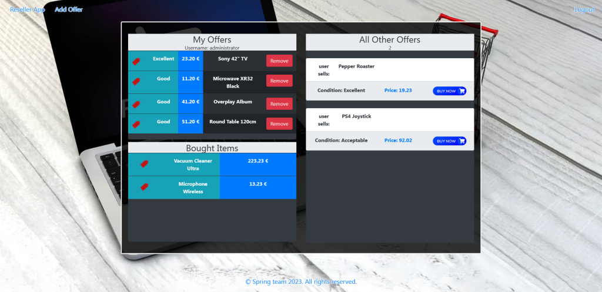

# Reseller Application

**_ResellerApp_** must represent the online marketplace dedicated to buying and selling new or used items.

**Requirements:**

**_1.Database Requirements_**

The Database of the Reseller application needs to support 3 entities:

- User
- Offer
- Condition

**_2.Initialize conditions_**

The application should have a method that checks (when the application is started) whether the database does not have conditions and method must autofill conditions data.

**_3.Pages Requirements_**

- Index Page (logged out user)

- Login Page (logged out user)

    - Login Page validations

- Register Page (logged out user)

    - Register Page validations

- Home Page (without having any offers)

- Add offer

    - Add offer validations

- Home Page (with offers)

**_4.Functional Requirements_**

- The application should provide Guest (not logged in) users with the functionality to log in, register and view the Index page.
- The application should provide Users (logged in) with the functionality to log out, add a new offer (Add offer page), view all offers (Home page) and buy an offer from All Other Offers to Bought Items.
- Reseller Application in navbar should redirect to the appropriate URL depending on that if the user is logged in.
- The application should provide functionality for adding offers with conditions of Excellent, Good or Acceptable.
- The offers should be separated into different sections according to their ownership.
- When the user clicks on the BUY NOW button of some offer, he buys the offer to his Bought Items. You should not delete this offer from DB. The offer should be removed from the collection with offers from the seller and should be added to the collection with boughtOffers of the buyer.
- The Remove button in My Offers section should remove the offer from DB.
- Bellow the All Other Offers banner is located an info bar that shows the sum of the offers in this field.

**_5.Security Requirements_**

- Guest (not logged in) users can access the Index page.
- Guest (not logged in) users can access the Login page.
- Guest (not logged in) users can access the Register page.
- Users (logged in) can access the Home page.
- Users (logged in) can access Add Offer page.
- Users (logged in) can access Logout functionality.