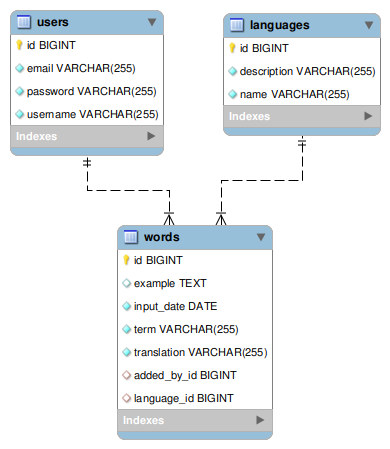

# Dictionary Application

**_DictionaryApp_** must represent online dictionary that provides an extensive database of words and their meanings, making it a reliable companion for German,
French, Spanish and Italian.

**Requirements:**

**_1.Database Requirements_**

The Database of the Dictionary application needs to support 3 entities:

- User
- Word
- Language

